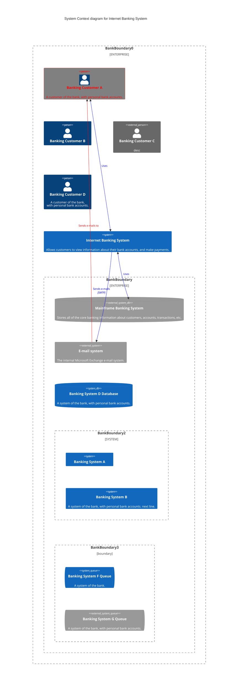
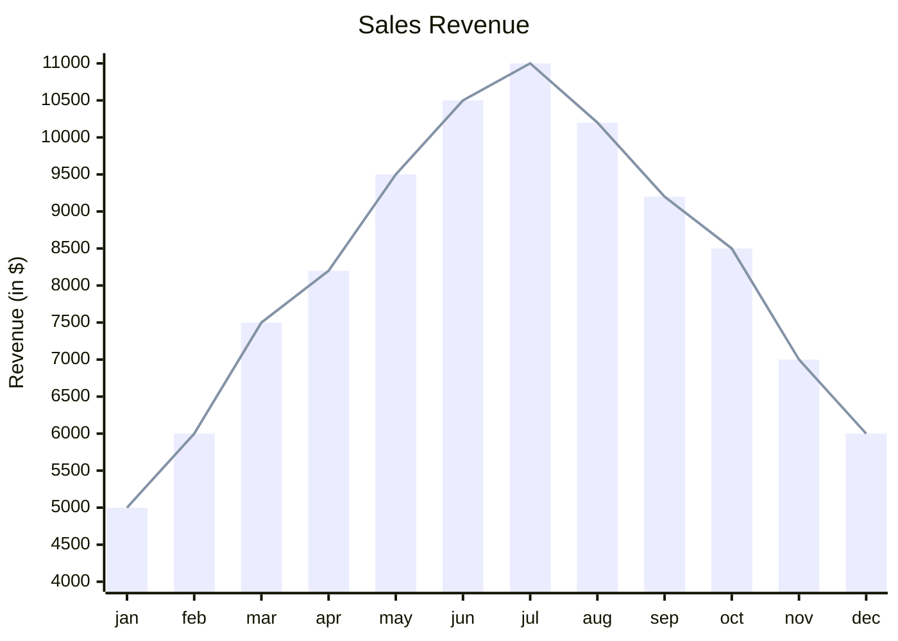
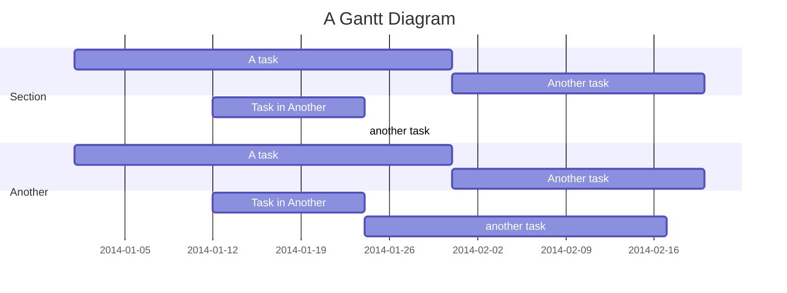
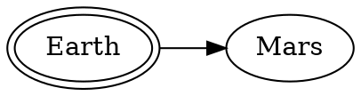

# Diagrams

## Mermaid
https://mermaid.js.org/intro/
### C4

```mermaid
 C4Context
      title System Context diagram for Internet Banking System
      Enterprise_Boundary(b0, "BankBoundary0") {
        Person(customerA, "Banking Customer A", "A customer of the bank, with personal bank accounts.")
        Person(customerB, "Banking Customer B")
        Person_Ext(customerC, "Banking Customer C", "desc")

        Person(customerD, "Banking Customer D", "A customer of the bank, <br/> with personal bank accounts.")

        System(SystemAA, "Internet Banking System", "Allows customers to view information about their bank accounts, and make payments.")

        Enterprise_Boundary(b1, "BankBoundary") {

          SystemDb_Ext(SystemE, "Mainframe Banking System", "Stores all of the core banking information about customers, accounts, transactions, etc.")

          System_Boundary(b2, "BankBoundary2") {
            System(SystemA, "Banking System A")
            System(SystemB, "Banking System B", "A system of the bank, with personal bank accounts. next line.")
          }

          System_Ext(SystemC, "E-mail system", "The internal Microsoft Exchange e-mail system.")
          SystemDb(SystemD, "Banking System D Database", "A system of the bank, with personal bank accounts.")

          Boundary(b3, "BankBoundary3", "boundary") {
            SystemQueue(SystemF, "Banking System F Queue", "A system of the bank.")
            SystemQueue_Ext(SystemG, "Banking System G Queue", "A system of the bank, with personal bank accounts.")
          }
        }
      }

      BiRel(customerA, SystemAA, "Uses")
      BiRel(SystemAA, SystemE, "Uses")
      Rel(SystemAA, SystemC, "Sends e-mails", "SMTP")
      Rel(SystemC, customerA, "Sends e-mails to")

      UpdateElementStyle(customerA, $fontColor="red", $bgColor="grey", $borderColor="red")
      UpdateRelStyle(customerA, SystemAA, $textColor="blue", $lineColor="blue", $offsetX="5")
      UpdateRelStyle(SystemAA, SystemE, $textColor="blue", $lineColor="blue", $offsetY="-10")
      UpdateRelStyle(SystemAA, SystemC, $textColor="blue", $lineColor="blue", $offsetY="-40", $offsetX="-50")
      UpdateRelStyle(SystemC, customerA, $textColor="red", $lineColor="red", $offsetX="-50", $offsetY="20")

      UpdateLayoutConfig($c4ShapeInRow="3", $c4BoundaryInRow="1")
```

### XY Chart

```mermaid
xychart-beta
    title "Sales Revenue"
    x-axis [jan, feb, mar, apr, may, jun, jul, aug, sep, oct, nov, dec]
    y-axis "Revenue (in $)" 4000 --> 11000
    bar [5000, 6000, 7500, 8200, 9500, 10500, 11000, 10200, 9200, 8500, 7000, 6000]
    line [5000, 6000, 7500, 8200, 9500, 10500, 11000, 10200, 9200, 8500, 7000, 6000]
```

### Gantt

```mermaid
gantt
    title A Gantt Diagram
    dateFormat YYYY-MM-DD
    section Section
        A task          :a1, 2014-01-01, 30d
        Another task    :after a1, 20d
    section Another
        Task in Another :2014-01-12, 12d
        another task    :24dgantt
    title A Gantt Diagram
    dateFormat YYYY-MM-DD
    section Section
        A task          :a1, 2014-01-01, 30d
        Another task    :after a1, 20d
    section Another
        Task in Another :2014-01-12, 12d
        another task    :24d
```

### Graphviz
https://graphviz.org/

```graphviz dot attack_plan.png
digraph G {
    rankdir=LR
    Earth [peripheries=2]
    Mars
    Earth -> Mars
}
```